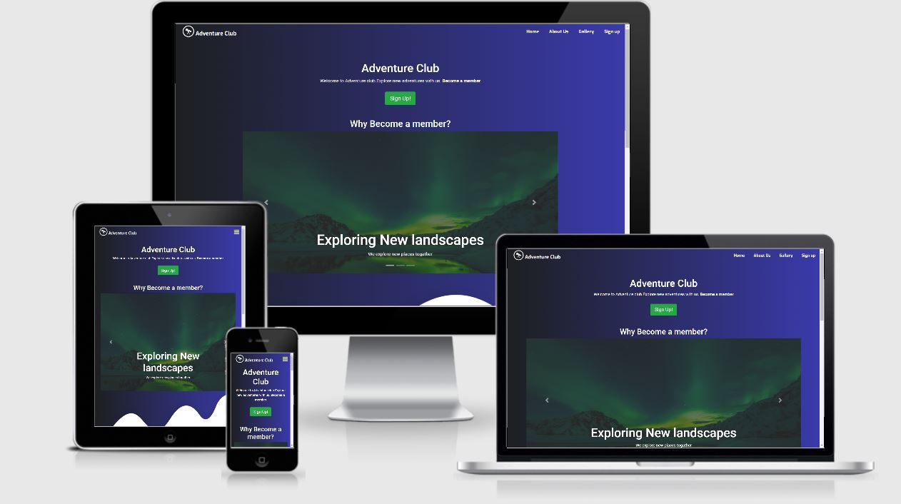

# Adventure Club - Milestone project 1

## Disclaimer
This website is for educational purpose only.This website informations are fictional and will not be deployed any from rather than for assesment.
Most of the pictures are taken by me and some of them I took from different sites.See Media credit section for Media citations.

## Advanture Club website
I have decided to make this website thinking about the unoffical community that me and my friends build 
in order to travel togather and do different kind social acitivies.I took inspiration from alot of travel and 
community websites but I have made the website in my own custom styling and theme.I have made up some most of information
in order to make the website more realistic.
Live Example [Here](https://kushal118.github.io/milestone-project/)

## User Experience Goals
My goal with this website is to make easy the people are living near by the area or far, 
can know the Advanture Club,its activities and become a member of the club easily. With 
this website people will find out what activities are done in the club and what are the common goal of this club and 
who runs the club.
This website is about a community where people from different background,class and different occupation comes 
togather for one common goal is to find Adventure.With this website you can join the community , 
find out about the acitivies and make new friends.

## website section
#### Theme and Style
I have used 3 fonts for the Website EXO, ROBOTO and LONG CHAG, all of them are Google fonts.I have made the 
theme of this website linear-gradient with black and blue which made the website bit mystery and very eye catching.
Also added wave pictures to match with linnear-gradient look.Most of the font colors are white in the gradient areas which makes
easy for users to read easily.
#### Navigation Bar
I have used Bootstrap navbar layout for my navigation bar but I have customized it with Club logo and Customize the navbar so that it doesnt look
like typical bootstrap navbar.I have matched the linnear-gradiet theme color with the navbar color so that it look eye catching.
#### Footer 
In Footer has three sections Soical Media section, Motivator and Contact details.I have Font Awesome icons within circles and put the  background color of the 
icon blue to match the Theme.Added Hover effect on the social media icons.
#### Home page
Home page has  a carosel displaying images with the Reasons to join the Adventure Club.I have put a banner along a with a signup botton with follows to the
sign-up form.Also home page has a testimonial section where current member gave their testimonals.I have put the images of the members in a circle along with
a border on the top which make that section look symentic.
#### About us
In About us I have put the describtion of the club. Below the describtion I have put the board member details along with pictures.I have added a hover effect on the picture of the members which will rise up and add color to the picture.Also added hover effect on more info.Clicking more info will extend the detail of the member.Also added the font family of Long chag it will look more amazing.
#### Gallery 
I have added picture using flex box in order to make the pictures more responsive.Also I have added the hover effect on the pictures which will make images bigger and rise up.
#### Sign up
I have used Simple signup form contsisting email and password.Also user can signup with their facebook account.
## Technologies Used
**Github** - Github was used for storing my code and version control as well as hosting the live site.  
**Gitpod** - I used Gitpod to code the site as well as push updates to Github.  
**Python** - Python 3 was used via terminal to run a local webserver to preview the site while coding.  
**Prettier** Code - I used Beautify to keep my code properly indented and easily readable.  
**HTML5** - The core of the site was built with HTML version 5.  
**CSS** - CSS was used to style the website and define fonts and layout.  
**Bootstrap** - Bootsrap was used to align items and create items such as the Navbar, accordion, carosel, flipcards, forms etc.   
**HVR** - I used hover effects from Ian Lunn at https://ianlunn.github.io/Hover/  
**Google Maps** - Google maps embed from Google inc.  
**Font Awesome** - Social Media icons from Font Awesome.  
**Google Chrome** - The website was built and tested in google Chrome.  
**Auto close tag** - self explanitory.  
**HTML hint** - for faster coding.  
**Bootstrap 4 CDN snippet** - faster bootstrap boilerplate.  
**Terms and Conditions generator** - Used to generate generic terms and conditions. https://www.termsandconditionsgenerator.com/
## Code Credits
- **Linear-gradient styling** was inspired from https://www.youtube.com/watch?v=v0IgI8vYD_o&t=2834s
- **Carosel** - from Bootstrap Documentation
- **Circle outline for images** was inspired from https://stackoverflow.com/questions/5394116/outline-radius
- **Testimonial layout** from https://www.youtube.com/watch?v=v0IgI8vYD_o&t=2834s
- **Hover Animations** from https://ianlunn.github.io/Hover/
- **Carosel overlay** from https://www.youtube.com/watch?v=SXQ9l0ScDEA&t=300s
- **Hover effects for social media icons** from https://www.w3schools.com/cssref/sel_hover.asp
- **Hover effec over board member** from https://stackoverflow.com/questions/7273927/image-greyscale-with-css-re-color-on-mouse-over
- **Navbar** from Bootsrap Documentation
- **Flexbox css** from https://www.w3schools.com/css/css3_flexbox.asp
## Photo Credits
**Image of Northen lights** is from https://www.contiki.com/six-two/guide-seeing-northern-lights/

## Testing
I tested my website in the following ways:
- Google Chrome Dev Tools for PC and mobile
- Safari on Mac, PC and iPhone
- Mozilla Firefox PC
- Microsoft Edge PC
- Am I responsive http://ami.responsivedesign.is/
- Asking friends and family to look and play with the site. 
- Different resolution screens on my PC and laptop.  

